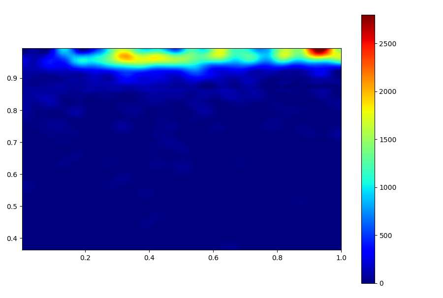
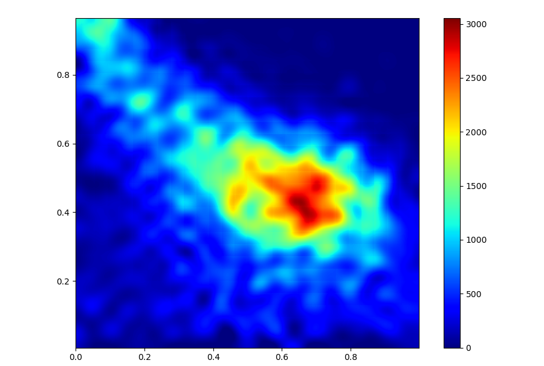

# 使用说明

运行后如果显示的FRET-S图不正常，如图


同样的数据选择正确的通道号后，正常ES图如下。


# 安装

    # fedroa
    sudo dnf install python3-tkinter
    pip3 install --user numpy scipy matplotlib pandas sklearn PyQt5 numba progressbar2 #mpi4py 
    # Use mpi4py from your disto.

# Lifetime 使用说明

    #不做bin
    python3 algo/fretAndLifetimeBurst.py -i /home/jwx/data/sqlite/rsc21c.sqlite -o /home/jwx/data/t.pickle
    #bin
    python3 algo/fretAndLifetimeBin.py -i /home/jwx/data/sqlite/rsc21c.sqlite -o /home/jwx/data/t.pickle -b 2
    python3 untils/exportF2mat.py -i /home/jwx/data/t.pickle -o /home/jwx/data/fret.mat
    # use matlab to fit

#  为 gSMFRETda 准备数据

```bash
untils/ptu2hdf.py
algo/arrivalTimePDAdata.py
```